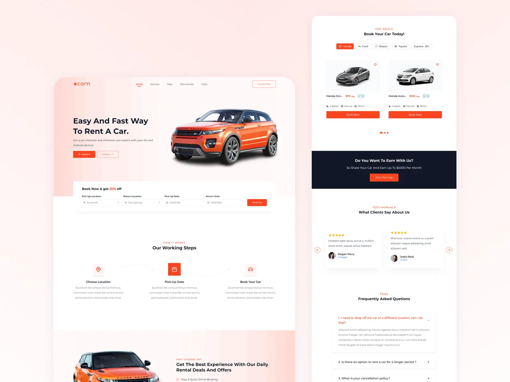

  

# Carn - NextJS Landing Page

<!-- PROJECT SHIELDS -->

  
  
   

Carn is an open-source landing page for car rental. Built with **[NextJS](https://nextjs.org/)**, **[Tailwind CSS](https://tailwindcss.com/)**, and **[Headless UI](https://headlessui.com/)**

<!-- TABLE OF CONTENT -->

  
Table of Contents

  <ol>
    <li>
      <a href="#getting-started">Getting Started</a>
      <ul>
        <li><a href="#prerequisites">Prerequisites</a></li>
        <li><a href="#setup">Setup</a></li>
      </ul>
    </li>
    <li>
      <a href="#deploy">Deploy</a>
      <ul>
        <li><a href="#vercel">Vercel</a></li>
        <li><a href="#netlify--github-pages--firebase-etc">Netlify / GitHub Pages / Firebase etc.</a></li>
      </ul>
    </li>
    <li><a href="#support">Support</a></li>
    <li><a href="#licence">Licence</a></li>
  </ol>

<!-- GETTING STARTED -->

## Getting Started

### Prerequisites

- IDE or code editor of your choice
- Node (v16.13.0 or higher)
- Yarn or NPM

(<a href="#readme-top">back to top</a>)

### Setup

Here is a run through of how to set up the application:

- **Step 1** : Clone this repository using **`git clone https://github.com/nilotpaldhar/carn.git`** or downloading a ZIP file of the code.
- **Step 2** : The repository, if downloaded as a .zip file will need to be extracted to your preferred location and opened.
- **Step 3** : Go to the project root directory and install the dependencies using: **`yarn install`** or **`npm install`**
- **Step 4** : Add Envirnoment Variables to your project:
  - Create a new copy of **`.env.sample`** file in your root directory and rename it to **`.env.local`**
- **Step 5** : On your terminal run **`yarn dev`** or **`npm run dev`** command to open a local development server on **`localhost:3000`**

(<a href="#readme-top">back to top</a>)

<!-- GETTING STARTED -->

## Deploy

### **Vercel**

The easiest way to deploy the application is to use the [Vercel Platform](https://vercel.com) from the creators of Next.js. Check out the [Next.js deployment documentation](https://nextjs.org/docs/deployment) for more details.

### **Netlify / GitHub Pages / Firebase etc.**

As the application uses **`next/image`** for image optimization, additional configurations have to be made to deploy on other popular static hosting websites like [Netlify](https://www.netlify.com/). Alternatively, replace the **`next/image`** component with a standard **``** tag. See [`next/image` documentation](https://nextjs.org/docs/basic-features/image-optimization) for more details.

(<a href="#readme-top">back to top</a>)

<!-- SUPPORT -->

## Support

Like 💖 this project? Support this effort by giving a star on GitHub, sharing it in your own blog, and giving a shoutout on Twitter

(<a href="#readme-top">back to top</a>)

<!-- LICENCE -->

## Licence

You are welcome to use this application however you wish under the [MIT](https://github.com/nilotpaldhar/carn/blob/main/LICENSE) license.

(<a href="#readme-top">back to top</a>)

